# CS 460 Assignment #1

by Michael Moen

September 23, 2024

## Trial Summaries

### Zone 1

|  | Path Length | Max Distance |
| - | - | - |
| **Trial 1** | 97.5 | 9.57 | Blue |
| **Trial 2** | 76.4 | 8.76 | Green |
| **Trial 3** | 72.6 | 9.02 | Yellow |
| **Trial 4** |  |  | Red |
| **Trial 5** |  |  | Purple |

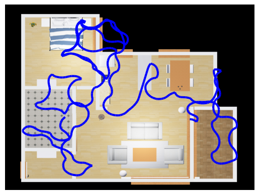

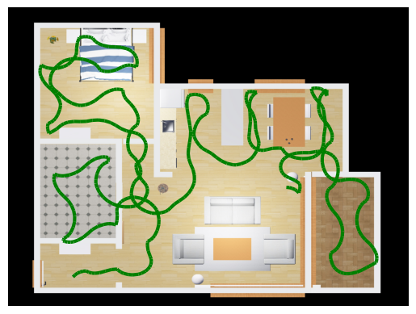

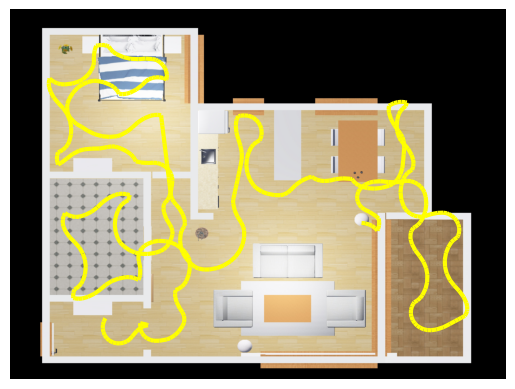

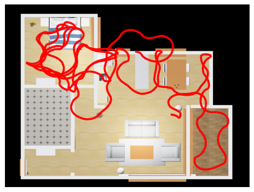

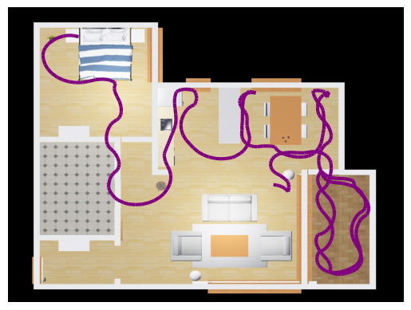

### Zone 2

|  | Path Length | Max Distance |
| - | - | - |
| **Trial 1** | 89.1 | 7.83 | Blue |
| **Trial 2** | 86.5 | 7.54 | Green |
| **Trial 3** | 96.1 | 10.6 | Yellow |
| **Trial 4** | 103.3 | 7.20 | Red |
| **Trial 5** | 92.4 | 6.41 | Purple |

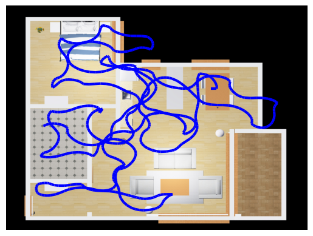

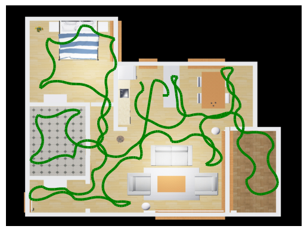

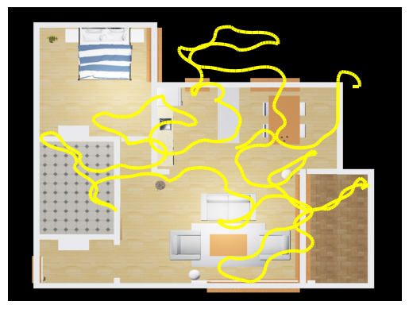

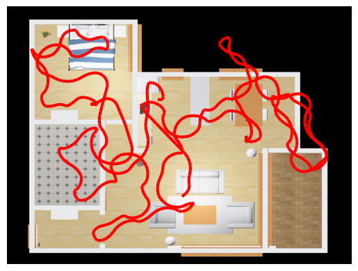

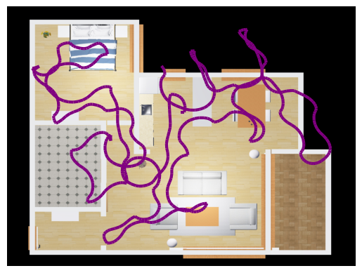

### Zone 3

|  | Path Length | Max Distance |
| - | - | - |
| **Trial 1** | 92.4 | 9.93 | Blue |
| **Trial 2** | 83.9 | 7.92 | Green |
| **Trial 3** | 83.7 | 10.9 | Yellow |
| **Trial 4** | 88.2 | 9.32 | Red |
| **Trial 5** | 90.5 | 11.0 | Purple |

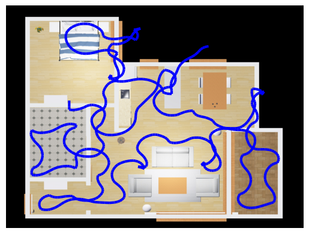

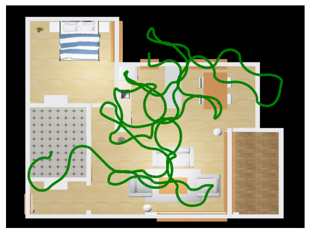

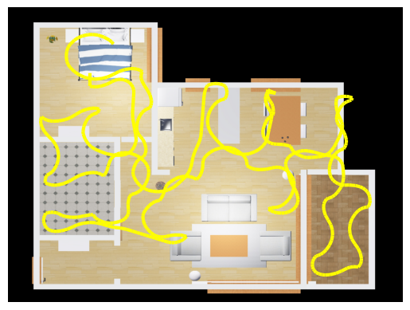

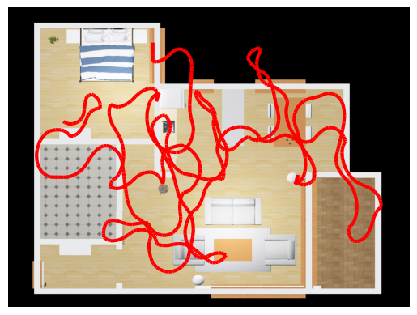

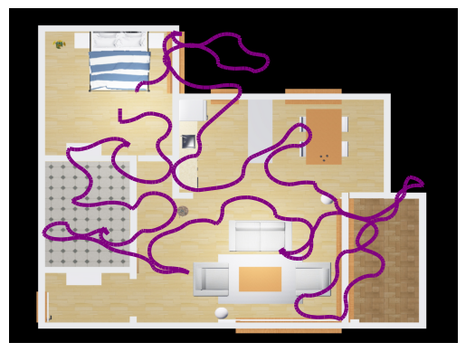

### Zone 4

|  | Path Length | Max Distance |
| - | - | - |
| **Trial 1** | 90.5 | 8.24 | Blue |
| **Trial 2** | 127.1 | 8.23 | Green |
| **Trial 3** | 147.3 | 7.32 | Yellow |
| **Trial 4** | 108.3 | 10.4 | Red |
| **Trial 5** | 134.2 | 10.1 | Purple |

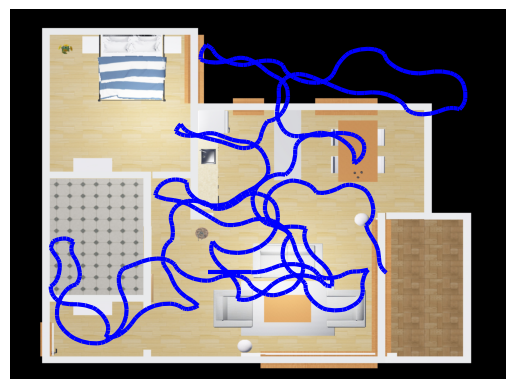

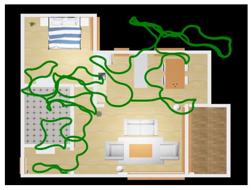

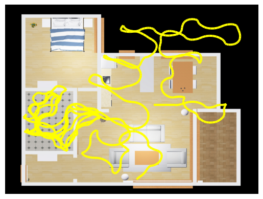

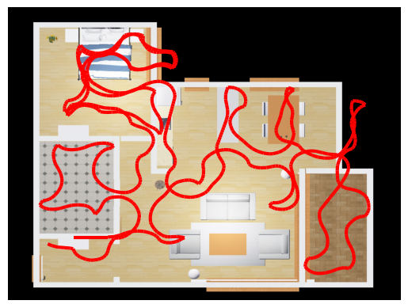

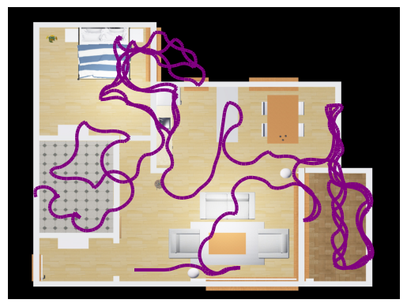

## Implementation Discussion

The solution used in this report follows a basic wall following algorithm.

### Start Phase

When the simulation is initially launched, the turtlebot begins its `start_phase`, which involves the turtlebot moving forward until it encounters an obstacle. At this point, the turtlebot turns left. It then uses its right and front LiDAR sensors to follow the wall.

```{python}
elif self.is_start_phase:
    self.cmd.angular.z = 0.0
    if front_lidar_min < 0.8:
        self.is_start_phase = False
        self.cmd.linear.x = 0.0
    else:
        self.cmd.linear.x = 0.2
    self.publisher_.publish(self.cmd)
```

### General Wall Following Cycle

The general wall-following cycle is done by setting the linear and angular velocity so that the turtlebot follows the wall from a certain distance. If the LiDAR readings stray too far from the wall, this typically indicates that the wall the turtlebot was tracking has come to an end (or corner), and the turtlebot will then slow down and increase its angular speed in order to turn around with the wall.

The values in the code below were determined by trial and error:

```{python}
if right_lidar_min < 0.53:
    if front_lidar_min > 0.5:
        self.cmd.linear.x = 0.2
    else:
        self.cmd.linear.x = 0.0
    self.cmd.angular.z = 0.2
elif right_lidar_min > 0.8:
    self.cmd.linear.x = 0.1
    self.cmd.angular.z = -0.25
elif right_lidar_min > 0.6:
    self.cmd.linear.x = 0.2
    self.cmd.angular.z = -0.2
else:
    self.cmd.linear.x = 0.2
    self.cmd.angular.z = 0.0
```

Though simple to program, this system has many drawbacks:
- Since the obstacle detection is measured from the front and right, issues can arise when encountering obstacles at an angle.
- When the turtlebot follows too closely to the wall, it will have trouble when encountering obstacles too low for the LiDAR to detect (carpet, baseboard, lamp base).
- When the turtlebot follows too far from the wall, it risks colliding with other obstacles in the room. In conjunction with the Crash Avoidance strategy discussed below, this can lead to the turtlebot missing the entrance to a room or looping around a room multiple times, as can be seen in some of the figures.

### Crash Avoidance

In the event that the turtlebot is about to crash into an object, the front LiDAR sensor detects this obstacle. When the obstacle is detected, the turtlebot stops its linear motion and begins rotating to the left until the the `front_lidar_min` reading increases.

```{python}
elif front_lidar_min < SAFE_STOP_DISTANCE:
    self.cmd.linear.x = 0.0
    self.cmd.angular.z = 0.2
    self.publisher_.publish(self.cmd)
```

### Stall Detection and Mitigation

The turtlebot uses LiDAR to detect any stalling. Initially, I tried to use the odometry data to detect stalling, but this didn't work because the odometry position is calculated based on the rotation of the wheels. However, when the wheels are turning but the robot isn't moving (because it is running into carpet or a baseboard lower than the LiDAR could detect), this does not allow us to detect stalling. Instead, I examined the LiDAR data to see if there were any changes in the position of the turtlebot.

In the code below, the turtlebot detects stalling by checking for updates in `left_lidar_min`, `front_lidar_min`, and `right_lidar_min` for every cycle in the main `timer_callback`. If the change in value of all of these sensors is less than `STALL_THRESHOLD` for `STALL_TIME_LIMIT` many cycles, then `self.stall` is set. It is important to note that this code produces false positives when rotating in a tight corner, since the minimum values of the LiDAR are not always updated quickly enough. This error could be eliminated by comparing the position values to the position when the `self.stall_time` timer starts, but this issue did not create any issues in this test environment.

```{python}
if not self.last_position:
    self.last_position = (left_lidar_min, front_lidar_min, right_lidar_min)
else:
    left_mvmt = math.fabs(self.last_position[0] - left_lidar_min)
    front_mvmt = math.fabs(self.last_position[1] - front_lidar_min)
    right_mvmt = math.fabs(self.last_position[2] - right_lidar_min)

    if left_mvmt < STALL_THRESHOLD and front_mvmt < STALL_THRESHOLD and right_mvmt < STALL_THRESHOLD:
        self.stall_time += 1
        if self.stall_time > STALL_TIME_LIMIT:
            self.stall = True
    else:
        self.stall_time = 0
        self.stall = False
    self.last_position = (left_lidar_min, front_lidar_min, right_lidar_min)
```

When `self.stall` is set in the code block above, it is handled with the following code in the main `timer_callback` cycle. The code below first causes the turtlebot to back out and turn, which helps it get out of any positions in which it is continuously ramming into an obstacle head-on (as often happened with the bookshelf and lamp). `self.stall_count` is used to override any other actions for 5 timer cycles so that the turtlebot focuses only on backing out of its current position.

```{python}
if self.stall:
    self.cmd.linear.x = -0.2
    self.cmd.angular.z = 0.5
    self.publisher_.publish(self.cmd)
    self.stall_count = 5
    self.stall_time = 0
    self.stall = False

if self.stall_count:
    self.cmd.angular.z = 0.3
    if self.stall_count > 2:
        self.cmd.linear.x = -0.2
    else:
        self.cmd.linear.x = 0.2
    self.publisher_.publish(self.cmd)
    self.stall_count -= 1
    self.stall_time = 0
```

While this approach did enough to complete the requirements of this assignment, it is important to note this method of detecting stalls has the severe disadvantage of requiring the turtlebot to ram into an obstacle. Given more development time, this method should be substituted for a safer and more consistent method.

